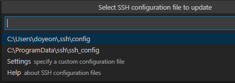
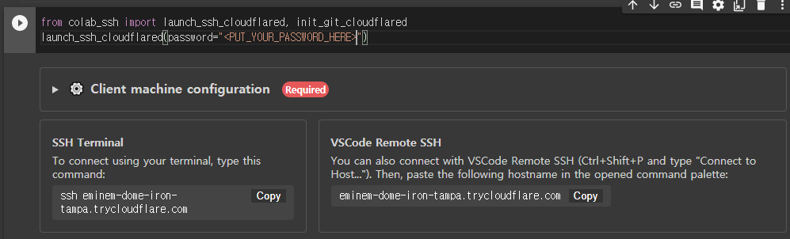
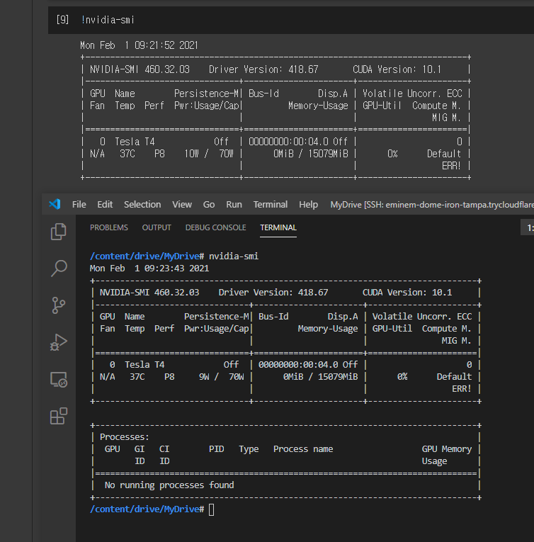

> 이 글은 [**`어느 미디엄 포스팅`**](https://medium.com/swlh/connecting-local-vscode-to-google-colabs-gpu-runtime-bceda3d6cf64)을 따라 하며 정리한 글입니다.

VSCode를 활용해 Google Colab의 GPU 런타임을 사용하기 위한 SSH 연결을 시도하는 과정을 정리했다.


1. cloudfare의 바이너리 파일이 필요하다. 

	>  [**`여기`**](https://developers.cloudflare.com/argo-tunnel/getting-started/installation)에서 각 os에 맞는 파일을 받으면 된다. 

2. 압축을 해제하면 생기는 (.exe)파일의 `절대경로`를 잘 알아놓는다. 

	- 나의 경우에는 `"C : \\ cloudflared.exe "`로 설정하였다. 
	- 참고로 `\`는 **<u>두 개</u>**를 써야 오류가 나지 않는다. 

3. VSCode를 실행하고, Extension에서 Remote-SSH 확장을 설치한다. 

4. 설치가 완료되면 `(Ctrl + Shift + P)`를 눌러 원격 구성파일을 검색한다. 

	1. `Remote-SSH : Open configuration file` 을 누른다.

	2. 아무 원격 구성파일(.ssh\config)을 누른다. 

	3. 나의 경우 C:\Users\username\.ssh\config를 선택

	4. 해당 파일에 다음과 같이 입력

		```python
		Host *.trycloudflare.com
		 HostName %h
		 User root
		 Port 22
		 ProxyCommand C:\\cloudflared.exe access ssh --hostname %h
		```

		> proxycommand(line 5)에 앞서 저장한 cloudflared.exe의 절대경로를 입력한다. 그 외엔 동일 입력

	5. 이 단계에서 주의할 점은, `.ssh\config` 파일을 만드는 것이 아니라, `Remote-SSH:Open configuration file`을 눌렀을 때 VSCode가 인식하고 있어야 한다는 점이다. 

		

		그래서 인식을 이미 하고 있는 위 두 경로중 위의 경로에 찾아 들어가 config 파일을 수정했다. 

5. Google colab을 열고 새 노트북을 시작한다. (GPU 런타임 설정)

6. 다음의 코드를 입력 후 실행

	```python
	# Install colab_ssh on google colab
	!pip install colab_ssh --upgrade
	
	from colab_ssh import launch_ssh_cloudflared, init_git_cloudflared
	launch_ssh_cloudflared(password="<PUT_YOUR_PASSWORD_HERE>")
	
	# Optional: if you want to clone a github repository
	# init_git_cloudflared(githubRepositoryUrl)
	```

	> <PUT_YOUR_PASSWORD_HERE>부분에 string으로 사용할 비밀번호 입력

7. 아래 그림에서 우측 하단의 vscode remote SSH의 command를 복사한다.
	

8. VSCode에서 `(Ctrl + Shift + P)`를 누르고 `Remot-SSH : Connet to host` 클릭!

9. 방금 전 복사한 remote ssh의 command를 붙여넣는다. 

10. 새로운 VSCode가 뜨면 위에 Linux, windows, mac 세 개의 os가 뜨는데 Linux를 선택한다.

11. 바로 다음에 뜨는 Continue를 클릭

12. 위에서 설정한 비밀번호를 입력한다. 

13. 잠시 기다리면 연결완료!

14. 상단 `terminal`탭에서 새 터미널을 실행한다. 

15. `nvidia-smi`를 입력하고 Colab의 Gpu할당과 같은지 확인한다. 
	

	> 성공적으로 연결된 모습

16. Colab에서 구글 cloud와 mount를 했다면, 좌측 `Explorer`에서 `/content/drive/MyDrive `에서 내 Cloud 파일을 확인할 수 있다.

