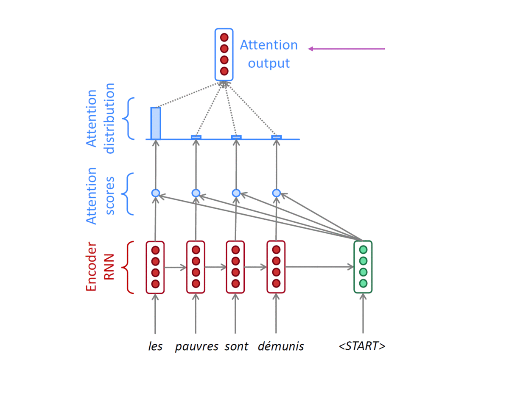
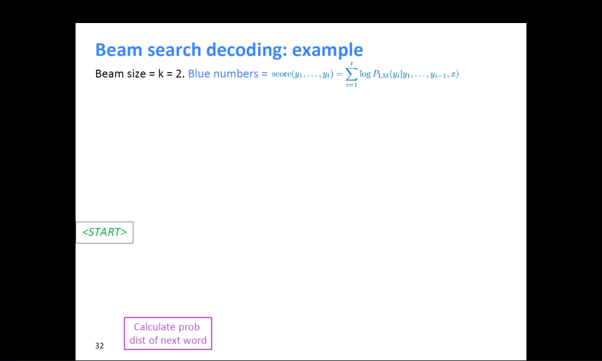

# Sequence to Sequence with Attention

Sequence를 Encoding와 Decoding할 수 있는 **sequence to sequence**에 대해 알아봅니다.

**Sequence to sequence**는 encoder와 decoder로 이루어져 있는 framework으로 대표적인 자연어 처리 architecture 중 하나입니다. Encoder와 Decoder로는 다양한 알고리즘이 사용될 수 있지만 이번 시간에는 **RNN과 Attention**을 결합한 sequence to sequence 모델을 학습합니다.

앞선 강의에서 설명드렸던 것처럼 RNN 모델이 갖고 있는 단점을 보완하고자 **Attention**(논문에서는 alignment로 표현되고 있습니다) 기법이 처음 등장했습니다. 다양한 Attention의 종류와 이를 활용한 translation task에 대해서 알아봅니다

**Further Reading**

- [Sequence to sequence learning with neural networks, ICML’14](https://arxiv.org/abs/1409.3215)
- [Effective Approaches to Attention-based Neural Machine Translation, EMNLP 2015](https://arxiv.org/abs/1508.04025)
- [CS224n(2019)_Lecture8_NMT](https://web.stanford.edu/class/cs224n/slides/cs224n-2019-lecture08-nmt.pdf)

 

## Seq2Seq with attention

### Seq2Seq Model

- It takes a `sequence of words` as input and gives `a sequence of words as output`
- It composed of an `encoder` and a `decoder`

{:.center}

> Sequence to sequence learning with neural networks, ICML’14

 

### Seq2Seq Model with Attention

- attention은 encoder decoder의 `bottleneck` 문제를 해결하였다.
- **Core idea :** Decoder의 각 timestep에 대하여, src sequence의 특정한 부분에 집중한다는 아이디어

{:.center}

- Use the attention distribution to take a weighted sum of the encoder hidden states
- The attention output mostly contains information the hidden states that received high attention

- Concatenate attention output with decoder hidden state, then use to compute $\hat{y}_1$as before
	- 첫 번째 Decoder hidden state $h_1^{(d)}$는 Encoder hidden state들의 concatenate $[h_1^{(e)},h_2^{(e)},h_3^{(e)},h_4^{(e)}]$와 Matrix 연산을 진행한다.
	- 위 그림에서는 4 by 4 matrix(concatenate of encoder hidden state)와 4 by 1 matrix(decoder hidden state)를 곱하게 된다. 
	- 그 결과로 나온 4 by 1 matrix(vector)는 encoder의 각 timestep에 해당하는 `attention scores`가 된다. 
	- 이렇게 계산된 attention score는 softmax를 거치게 된다. 
	- 그 결과 각 token에 해당하는 가중치 벡터를 얻게되고, 이 가중치와 encoder hidden state를 반영한 `가중평균`을 바탕을 Attention output vector(Context vector)를 구할 수 있다. 
	- 이때, `ATTENTION MODULE`은 encoder hidden state로 부터 구해지는 Attention score와 Attention distribution(softmax output) 두 부분으로 정의할 수 있다.
	- Attention module의 input과 output은 다음과 같다.
		- input : decoder의 hidden state, encoder hidden state의 concatenate
		- output : 가중평균으로 계산된 output vector 1개
	- `output layer`는 Context vector와 decoder의 hidden state를 concatenate한 벡터($\hat{y}_1$)가 Input으로 들어간다. 
- Training : Decoder의 input으로 들어가는 단어들은 ground truth로 들어가게 된다. (Teacher forcing 방식)
- Inference : 이때는 첫 번째의 output 단어를 다시 두번째 input 단어로 사용한다. 
- Teacher forcing의 경우, 속도는 빠르지만 실제 사용했을 때 괴리가 있을 수 있다. 
 

### Different Attention Mechanisms

- **`Luong attention`**: they get the decoder hidden state at time 𝑡, then calculate attention scores, and from that get the context vector which will be concatenated with hidden state of the decoder and then predict the output. 
- **`Bahdanau attention`**: At time **t**, we consider the hidden state of the decoder at time **t − 1**. Then we calculate the alignment, context vectors as above. But then we concatenate this context with hidden state of the decoder at time t − 1. So before the softmax, this concatenated vector goes inside a LSTM unit. 
- **Luong** has different types of alignments. **Bahdanau** has only a concat-score alignment model.

{:.center}

- 다양한 방식의 attention score를 계산하는 방식이 존재한다. 
 

### Attention is Great!

- Attention significantly improves NMT performance
	- It is useful to allow the decoder to focus on particular parts of the source
- Attention solves the bottleneck problem
	- Attention allows the decoder to look directly at source; bypass the bottleneck
- Attention helps with vanishing gradient problem
	- Provides a shortcut to far-away states
- Attention provides some interpretability
	- By inspecting attention distribution, we can see what the decoder was focusing on
	- The network just learned alignment by itself
 

### Attention Examples in Machine Translation

- It properly learns grammatical orders of words
- It skips unnecessary words such as an article

{:.center}
 

# Beam Search and BLEU

**강의 소개**

문장을 decoding 하는 데에 사용하는 대표적인 알고리즘인 **Beam Search**와 번역 task에서 번역된 문장을 평가하는 대표적인 metric인 **BLEU score**를 소개합니다.

언어 모델이 문장을 generation할 때에는 확률값에 기반한 다양한 경우의 수가 존재합니다. 모든 경우의 수를 고려하는 것은 비효율적이며 너무 작은 확률값까지 고려한다면 생성된 문장의 quality가 떨어질 수 있습니다. 가장 높은 확률값을 고려하는 방법 역시 모델이 단순한 generation을 하도록 하게 만드는 단점이 있을 수 있습니다. 이러한 문제의 대안으로 제안된 Beam Search를 알아봅니다.

자연어는 컴퓨터가 이해할 수 있는 방식으로 변환되어 모델의 입력 및 출력으로 활용되기 때문에 적절한 metric을 이용해 모델을 평가해야 합니다. 다양한 자연어처리 관련 metric이 있지만, 그중에서도 번역 task에서 가장 대표적인 BLEU score를 소개합니다. 번역에 있어서 BLEU score가 precision을 고려하는 이유에 대해서 고민하면서 강의를 들어주시면 좋을 것 같습니다.

**Further Reading**

- [Deep learning.ai-BeamSearch](https://www.youtube.com/watch?v=RLWuzLLSIgw&feature=youtu.be)
- [Deep learning.ai-RefiningBeamSearch](https://www.youtube.com/watch?v=gb__z7LlN_4&feature=youtu.be)
- [OpenNMT-beam search](https://opennmt.net/OpenNMT/translation/beam_search/)

**Further Question**

- BLEU score가 번역 문장 평가에 있어서 갖는 단점은 무엇이 있을까요?
   - 참고: [Tangled up in BLEU: Reevaluating the Evaluation of Automatic Machine Translation Evaluation Metrics](https://arxiv.org/abs/2006.06264?utm_source=feedburner&utm_medium=feed&utm_campaign=Feed%3A+arxiv%2FQSXk+%28ExcitingAds%21+cs+updates+on+arXiv.org%29)

 

## Beam search

자연어 생성모델에서 테스트 타임시 더 좋은 결과를 내기 위한 방법인 `beam search`를 알아보자. 
 

### Greedy approach

텍스트 생성시 모델은 가장 높은 확률로 등장할 단어를 출력하게 된다. 이 방법은 전체적인 구조에서의 확률값을 보는 것이 아니라 근시안적으로 현재 timestep에서 가장 좋아보이는 단어를 선택하는 형태를 `Greedy approach`라고 한다.

- Greedy decoding has no way to undo decisions!
   - input : il a m’entarté (he hit me with a pie)
      - he \___
      - he hit \___
      - he hit `a` \___ ~~(whoops, no going back now…)~~

위 예시에서 `hit` 다음 `me`가 나와야할 차례에 `a`가 나왔다고 했을 때, 이어 나오는 모든 예측은 틀어지게 된다. 그 이유는 뒤에서 사용해야할 단어를 이미 앞에서 생성해버렸기 때문이다. 이미 뒤늦게 깨달았다고 하더라도 이미 고정된 예측값은 바꿀 수 없다. 

 

### Exhaustive search

***Then how can we fix this?***

- Ideally, we want to find a (length $T$) translation $y$ that maximizes. 
   $$
   \begin{align}
   P(y\vert x)
   &=P(y_1\vert x)P(y_2\vert y_1, x)P(y_3\vert y_2, y_1, x)\dots P(y_T\vert y_1, \dots , y_{T-1}, x)\\
   &= \prod_1^TP(y_t\vert y_1, \dots , y_{t-1}, x)
   \end{align}
   $$

- We could try computing **all possible sequences** $y$

   - This means that on each step $t$ of the decoder, we are tracking $V^t$ possible partial translations, where $V$ is the vocabulary size
   - This $O(V^t)$ complexity is far too expensive!

즉, joint probability에서 순차적으로 각각의 최대를 곱한 값이 전체의 최대는 아닐 수도 있다는 것이며 앞에서 약간의 손해(작은 확률값)를 보더라도 뒤에서 만회할 수 있는 확률값을 선택하는 것이 이 아이디어의 핵심이다. 

하지만, 매 timestep마다 모든 가짓수를 고려한다면 너무 많은 계산량이 필요하다. 

 

### Beam search

디코더의 매 타임마다 적절한 $k$개의 가짓수를 고려하고, 그 중에서 가장 확률이 높은 것을 택하는 방법이다. 

> Core idea: on each time step of the decoder, we keep track of the $k$ most probable partial translations (which we call hypothese)
>
> - $k$ is the beam size (in practice around 5 to 10)
>
> A hypothesis $y_1, \dots, y_t$ has a score of its log probability:
> $$
> score(y_1, \dots, y_t) = logP_{LM}(y_1, \dots, y_t\vert x)=\sum^t_{i=1}logP_{LM}(y_i\vert y_1, \dots, y_{t-1},x)
> $$
> Scores are all negative, and a higher score is better  
> We search for high-scoring hypotheses, tracking the top k ones on each step  

log를 씌움으로써 곱셈을 덧셈연산으로 바꾸고, 추척하기 쉽도록 하는 것이 목표

- Beam search is not guaranteed to find a globally optimal solution.
- But it is much more efficient than exhaustive search!

모든 경우를 다 보는 것은 아니지만, 후보군을 추리기 쉽다.!!!

**example)**

{:width="80%"}{:.center}

> 출처 : [https://web.stanford.edu/class/cs224n/slides/cs224n-2019-lecture08-nmt.pdf](https://web.stanford.edu/class/cs224n/slides/cs224n-2019-lecture08-nmt.pdf)

위와 같이 k=2일 때, 계속적으로 확률이 높은 후보군을 찾으면서 결과를 예측한다. 
 

### Beam search: Stopping criterion

- Usually we continue beam search until:
  - We reach timestep 𝑇 (where 𝑇 is some pre-defined cutoff), or 
  - We have at least 𝑛 completed hypotheses (where 𝑛 is the pre-defined cutoff)

 

### Beam search: Finishing up

- We have our list of completed hypotheses
- How to select the top one with the highest score?
- Each hypothesis $𝑦_1, … , 𝑦_t$ on our list has a score

$$
score(y_1, \dots, y_t) = logP_{LM}(y_1, \dots, y_t\vert x)=\sum^t_{i=1}logP_{LM}(y_i\vert y_1, \dots, y_{t-1},x)
$$

- Problem with this : **longer hypotheses have lower scores**
- Fix : Normalize by length

$$
score(y_1, \dots, y_t) = \frac{1}{t}\sum^t_{i=1}logP_{LM}(y_i\vert y_1, \dots, y_{t-1},x)
$$

 

## BLEU score

자연어 생성 모델에서 생성 모델의 품질 및 결과를 평가하는 scoring 방식을 알아보자